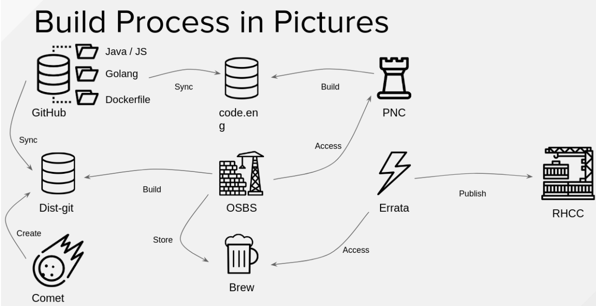

# Brew 

Brew is Red Hat's build system. It is designed to build packages and containers from source in a reproducible and auditable manner, and to keep track of those for the lifetime of their related products. 

Brew provides three means of user interaction (all authenticated via kerberos):

* A web based interface – https://brewweb.engineering.redhat.com/brew/
* A command line interface called brew
* An XMLRPC interface

