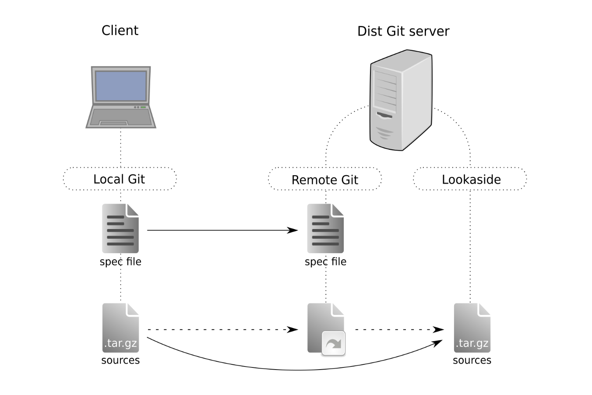

# Dist-Git

DistGit (Distribution Git) is Git with additional data storage. It is designed to hold container and package (rpm) code, and consists of these three main components:

* Git repositories
* Lookaside cache to store source tarballs
* Scripts to manage both

RPM source package typically contains a spec file and the sources (upstream tarball + additional patches). Source tarballs, being binary and potentially large, are not very well suited to be placed in a Git repository. On each update, Git would produce a huge, meaningless diff. That's why DistGit was introduced as it employs an efficient lookaside cache where the tarballs can be stored. The Git repo itself can then be left to do what it does best: keep track of changes on the spec file, downstream patches, and an additional text file called sources that contains a link to the source tarball in the lookaside cache.

